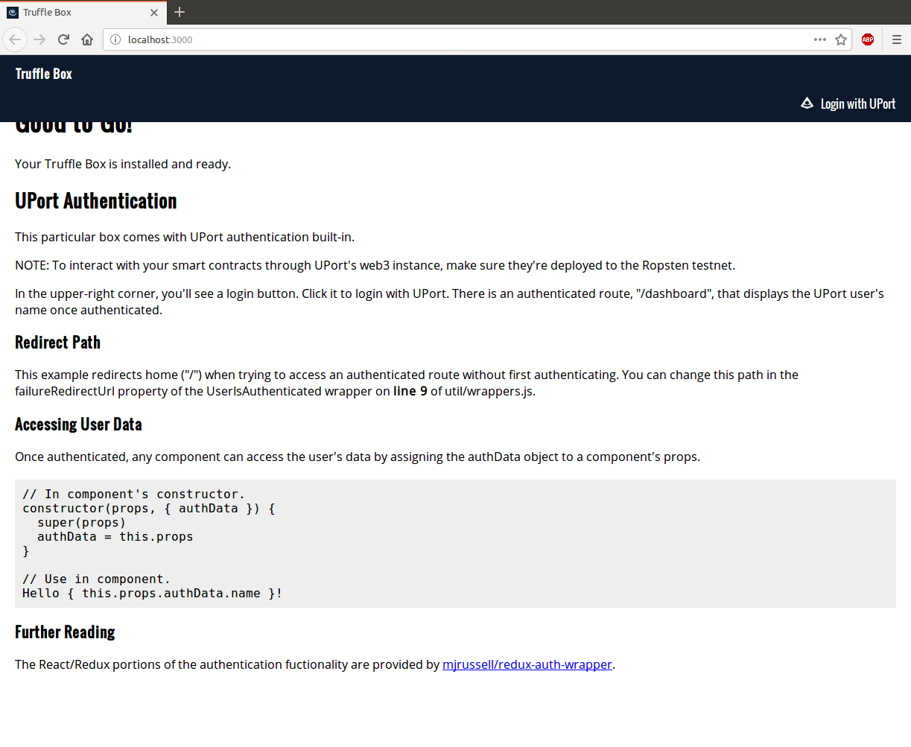

# Adopt-A-Dog
dApp Adopt-A-Dog simulates an adoption site by tracking the adopter to the dog they decide to adopt.

## Set up the project

- Install [NodeJS](https://nodejs.org/en/) (version `v6` at least)
- Install and run [Ganache](https://truffleframework.com/ganache)
- Install and run [MetaMask] (https://metamask.io/):
   1. Install MetaMask in your browser.
   2. Once installed, you'll see the MetaMask fox icon next to your address bar. Click the icon and you'll see the Privacy Notice appear.
   3. Click *Accept* to accept the Privacy Notice.
   4. Then you'll see the Terms of Use. Read them, scrolling to the bottom, and then click *Accept* there too.
   5. Click *Import Existing DEN*.
   6. In the box marked *Wallet Seed*, enter the mnemonic that is given in Ganache.
   7. Enter a password below that and click *OK*.
   8. Connect MetaMask to the blockchain created by Ganache by clicking the menu that shows "Main Network" and selecting "Custom RPC".
   9. In the box titled "New RPC URL" enter `http://127.0.0.1:7545` and click *Save*. The network name at the top will switch to say "Private Network".

## Run the project
- `npm install`
- `truffle test`
- `truffle compile`
- `truffle migrate`
- `npm run start`
- navigate to [http://localhost:3000](http://localhost:3000)

_Note_: Please make sure to have Ganache running at all times.

## Workflow

1. [http://localhost:3000](http://localhost:3000) will take you to something similar to the following:

